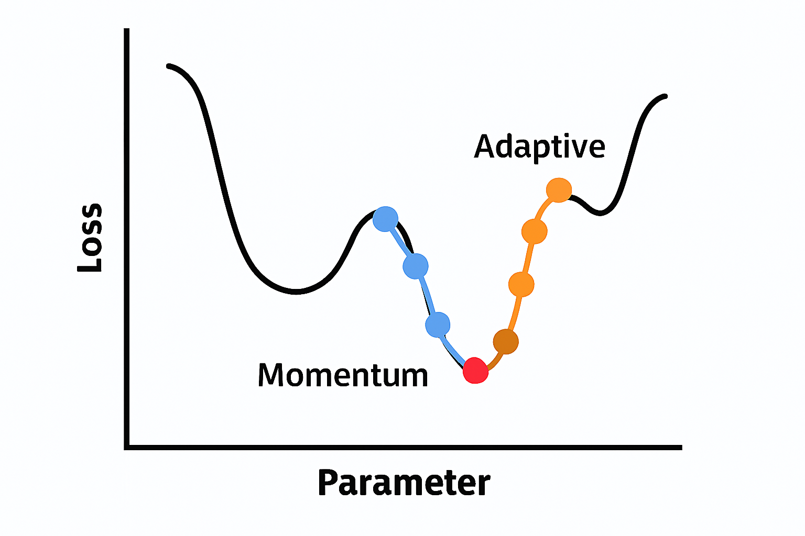

* **Local Minimum** : 곡선의 작은 골짜기처럼 보이는 지점이에요. 손실(loss)이 줄어들긴 했지만, 더 낮은 값이 다른 곳에 존재합니다. 학습이 여기서 멈추면 최적이 아닌 결과를 얻게 됩니다.
* **Global Minimum** : 곡선 전체에서 가장 낮은 지점이에요. 손실이 가장 작은 최적의 상태로, 모델이 가장 잘 학습된 경우를 의미합니다.

* > 🟠 **Adaptive Optimizer (예: Adam, RMSProp) : 똑똑한 내비게이션
  >
  > 길이 복잡해도 빠르게 목적지 찾아감**
  >

  * 빠르게 움직이며 손실을 줄이지만 경로가 지그재그로 흔들릴 수 있음
  * 각 파라미터마다 학습률을 자동 조절
  * **장점** : 빠른 수렴, 복잡한 지형에서도 잘 작동
  * **단점** : 과적합 위험, 불안정한 경로
* > 🔵 **Momentum Optimizer (예: SGD with Momentum) : 관성 있는 자동차
  >
  > 방향을 기억하며 부드럽게 움직임**
  >

  * 이전 기울기를 기억해 관성을 갖고 부드럽게 이동
  * **장점** : 안정적인 수렴, 진동 감소
  * **단점** : 학습률 조절이 필요, 수렴 속도가 느릴 수 있음
